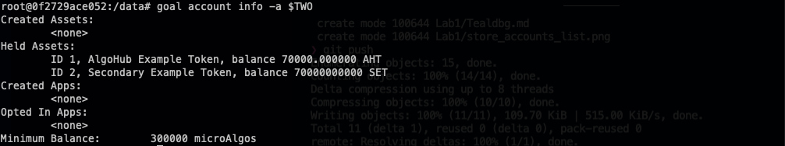

# Creating and interacting with assets

## Creating the assets
To start, let's create some assets. For the creator, we are using the first account that we previously saved as a variable `$ONE`.

```bash
goal asset create --creator $ONE --name "AlgoHub Example Token"  --total 1000000000000000 --unitname AHT --decimals 6
goal asset create --creator $ONE --name "Secondary Example Token" --total 10000000000000000 --unitname SET --decimals 0
```

In the image below, you can see an example of the output.


To make our future transactions easier, we'll store the asset ids in environment variables. My asset id's were 1 and 2 (and if you have followed this Lab, your's should be the same).

```bash
export AHT=1
export SET=2
```

## Transferring assets
Before transferring between accounts, we need to opt our accounts into the assets. To opt in to an asset, we send a 0 value transaction of the asset from an account to the same account. 

If you recall, our three accounts are stored in variables ONE, TWO and THREE.

```bash
goal asset send --assetid $AHT -f $ONE -t $ONE --amount 0
goal asset send --assetid $AHT -f $TWO -t $TWO --amount 0
goal asset send --assetid $AHT -f $THREE -t $THREE --amount 0
goal asset send --assetid $SET -f $ONE -t $ONE --amount 0
goal asset send --assetid $SET -f $TWO -t $TWO --amount 0
goal asset send --assetid $SET -f $THREE -t $THREE --amount 0
```

Next, we'll transfer some of each token from account ONE (the creator) to account TWO.

```bash
goal asset send --amount 70000000000 -f $ONE -t $TWO --assetid $AHT
goal asset send --amount 70000000000 -f $ONE -t $TWO --assetid $SET
```

## Viewing assets
Now that we have transferred the asset, let's view it in TWO's account
```bash
goal account info -a $TWO
```



That's weird! Even though we transferred the same amount of tokens, for AlgoHub Example Token (AHT) we have 70000.000000, and for Secondary Example Token (SET) we have 70000000000. 

That's because when we created the tokens, we specified 6 decimals for AHT and 0 for SET, and when we transfer tokens there is no concept of decimals.


