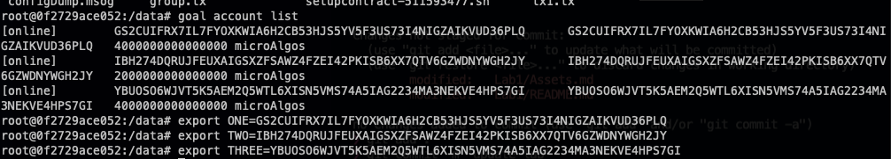

# Lab 1 - Getting familar with Goal, tealdbg and the command line

Hi everyone! The focus of this first lab is to setup your environment and get you comfortable working with the command line - as this will be really helpful when deploying, testing and experimenting with smart contracts.

These examples will be running on a Macbook Pro running MacOS, but can also be used with other operating systems.

## Pre-requisites
- A computer
- Docker/Docker-compose
- a code editor (I will be using VSCode - free software available for all platforms [here](https://code.visualstudio.com/))

## Environment setup
For this exercise we will be using [Algorand Sandbox](https://github.com/algorand/sandbox). In our live video we will walk through the setup for MacOS, but the github linked above has tips for all environments.

Note: The instructions below assume you have the pre-requisites installed and that you are using the command line (terminal on MacOS/Ubuntu, or WSL2 on Windows).

Some of the following is taken from the [Algorand Sandbox - Getting Started](https://github.com/algorand/sandbox#getting-started)) - we recommend you review their setup guide also.

Open your favourite terminal and make a directory for the course and change directory into it
```bash
mkdir algohub-pyteal
cd algohub-pyteal
```

Next we need to download the sandbox from git

```bash
git clone https://github.com/algorand/sandbox.git
```

Now we clone this repo into the course directory

```bash
git clone https://github.com/Algo-Hub-io/pyteal-course.git
```
We clone this repo so that you can access the scripts and contracts to deploy for the labs.

Next, we need to update the sandbox file `docker-compose.yml` to allow us to access our files on our local machine from within the docker container.

To do this, open `sandbox/docker-compose.yml` and add the following to the end of the algod service.

Existing Algod service;
```
  algod:
    container_name: "algorand-sandbox-algod"
    build:
      context: .
      dockerfile: ./images/algod/Dockerfile
      args:
        CHANNEL: "${ALGOD_CHANNEL}"
        URL: "${ALGOD_URL}"
        BRANCH: "${ALGOD_BRANCH}"
        SHA: "${ALGOD_SHA}"
        BOOTSTRAP_URL: "${NETWORK_BOOTSTRAP_URL}"
        GENESIS_FILE: "${NETWORK_GENESIS_FILE}"
        TEMPLATE: "${NETWORK_TEMPLATE:-images/algod/template.json}"
        TOKEN: "aaaaaaaaaaaaaaaaaaaaaaaaaaaaaaaaaaaaaaaaaaaaaaaaaaaaaaaaaaaaaaaa"
        ALGOD_PORT: "4001"
        KMD_PORT: "4002"
        CDT_PORT: "9392"
    ports:
      - 4001:4001
      - 4002:4002
      - 9392:9392
```

and add the following after ports

```
volumes:
      - type: bind
        source: ../pyteal-course
        target: /data
```

This allows us to access the contents of our labs from within the algod docker box.

Now, we get to bring our the sandbox.

In the sandbox folder run the following in the terminal
```bash
./sandbox up dev -v
```

This will download all of the relevant docker images and setup the sandbox - it can take a while, so we add the `-v` tag to the end so that it shows the steps it is taking.

Once that's done (could be 5-10 minutes), we enter the algod box.

```bash
./sandbox enter algod
```
Now we're inside the algod container (this makes it easier to make with goal and tealdbg later in this Lab).

Next we're going to get our account addresses.

First we get our accounts
```bash
goal accounts list
```

*Note: This is a dev environment that is just on your machine, so DO NOT send real algos or any assets to these addresses*

Now we store each of these as an environment variable for use later (I will be using ONE, TWO, and THREE). These environment variables will dissappear if you end the session, so you may also want to record them elsewhere.

To store environment variables, we use `export VAR_NAME=VARIABLE`, then to reference them later we use `$VAR_NAME`.

This is what it looks like when I do it



Great! Now we're ready for the other sections.

[Creating and transferring assets](Assets.md)

[Deploy and call a smart contract through the command line](./SmartContracts.md)

[Using Tealdbg to step through a smart contract](./Tealdbg.md)


