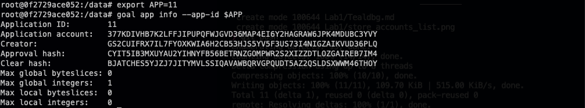

# Deploying a Smart Contract
The first step in deploying a smart contract is in compiling one. I have taken the liberty of preparing one earlier - a [simple counter example from the algorand developer documentation](https://developer.algorand.org/docs/get-details/dapps/pyteal/#final-product).

The approval program (the main part of the stateful algorand application) and the clear program have been saved in `approval.teal` and `clear.teal` in this folder, and we will deploy them to our sandbox environment.

Next we deploy the smart contract. 

We will use account ONE as the creator, and we have to specific global byteslices and ints as well as local byteslices and ints. 

You can think of a byteslice as a fixed length string (or other data in bytes). and ints as numbers stored.

Global indicates that the value is stored in the application on the ledger, and local indicates it is stored on the users account.

As this is a relatively simple app, we only have 1 global int (the counter), and no application args are required at creation time.

First, we move to the data directory which will allow us to access the shared docker volume that we set up earlier.

```bash
cd /data
```

Next we deploy the app.

```bash
goal app create --creator $ONE --approval-prog Lab1/approval.teal --clear-prog Lab1/clear.teal --global-ints 1 --global-byteslices 0  --local-ints 0 --local-byteslices 0
```

This will return an application ID (11 in my case), which we then store in the APP environment variable for later use.
```bash
export APP=11
```

Now we can view the smart contract on the blockchain by typing `goal app info --app-id $APP`.



## Interacting with the smart contract
This smart contract is a counter, so it has two functions we can call - Add and Deduct.

First, let's check the value of the counter.

To do that, we will get the global state of the app, and guess the format (to make it readable).

```bash
goal app read --global --guess-format --app-id $APP
```
From that command, we can see that the counter value is currently not showing (which is equal to zero), and that the expected value is an integer (that is what `"tt": 2` is equal to).
```bash
{
  "Count": {
    "tt": 2
  }
```

Now we increment the counter by 1;

```bash
goal app call --app-id $APP -f $ONE --app-arg 'string:Add'
```
We can see that the counter now has a value of 1.
```bash
{
  "Count": {
    "tt": 2,
    "ui": 1
  }
```