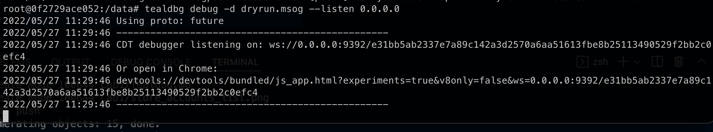

# Stepping through a smart contract with TealDbg
Tealdbg is Algorand's tool for debugging smart contracts.

For more information you can read Algorand's [official documentation](https://github.com/algorand/go-algorand/blob/master/cmd/tealdbg/README.md).

For the transaction to debug, we will use the deduct function to lower the counter.

```bash
goal app call --app-id $APP -f $ONE --app-arg 'string:Deduct' --dryrun-dump -o dryrun.msog
```

As you can see above, we make the same app call, but we add the options `--dryrun-dyump -o dryrun.msog`.

This tells goal to export the goal call into a specific format and store it in the file `dryrun.msog`.

Next we run tealdbg against the file. 

```bash
tealdbg debug -d dryrun.msog --listen 0.0.0.0
```

We add `--listen 0.0.0.0` to the command as we are running the debugger inside a container.



If you copy and paste the link for Chrome devtools, you can view the debug session in Chrome (or Brave) browser. However, we can also manually open the Chrome devtools and connect to the debugger by:
- Going to: `chrome://inspect/#devices`.
- Clicking on `Configure...`.
- Adding `localhost:9392` to the list of address in "Target discovery settings".
- Clicking on `Done`.

The Algorand debugger will now show up in the list of devices. Start the debugger by clicking on `Inspect`.

This will allow you to step through the TEAL contract using the step through button.