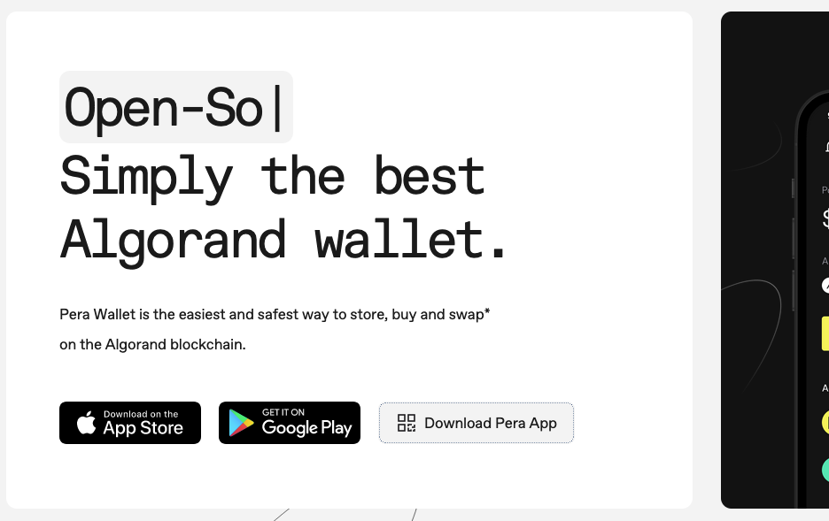
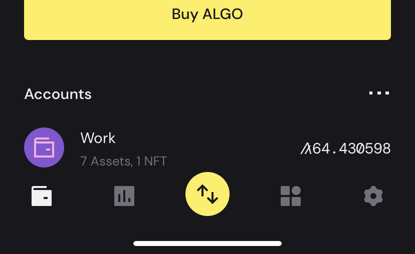
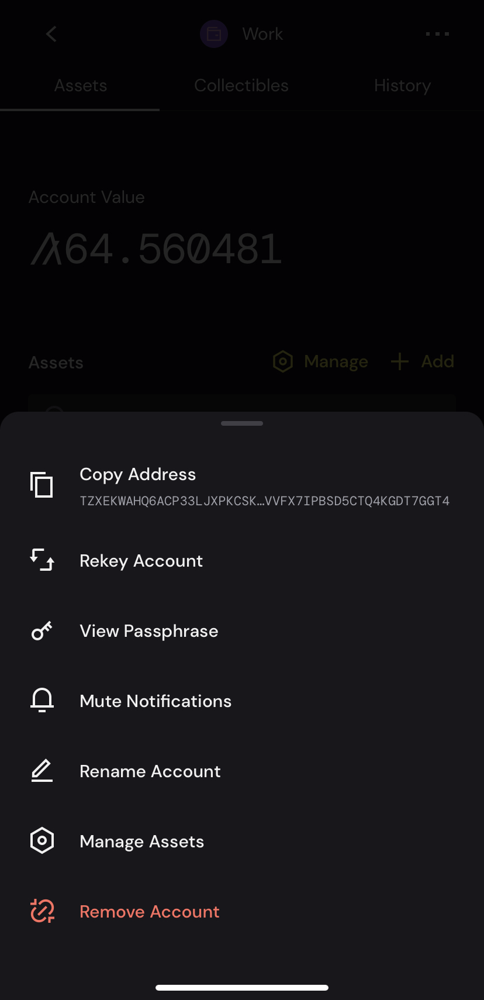
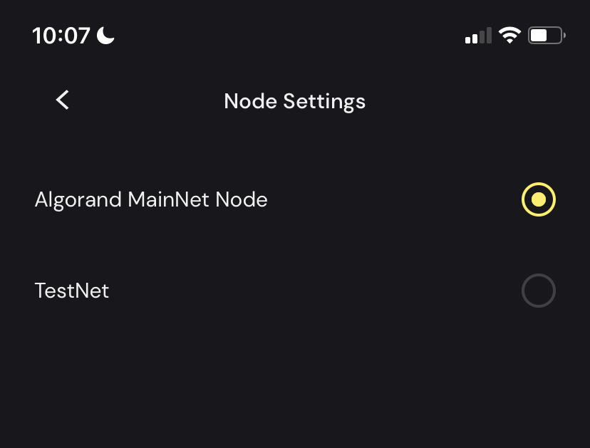

# Lab 2 - Deploying to Testnet and Interacting with Smart Contracts in the Browser

Hi everyone! For this Lab, we are going to be using the environment we setup in Lab 1. So if you haven't been through that exercise yet, you can find it [here](../Lab1/README.md).

In this tutorial, we are going to be deploying our smart contract to the Algorand testnet, setting up a Pera Wallet and configuring a [template](https://github.com/Algo-Hub-io/counter-app) that we have created which allows us to interact with our smart contract through our browser.

## Pre-requisites
- a sandbox environment setup using docker (as completed in [Lab 1](./../Lab1/README.md))
- A code editor (for the tutorial, I will be using [VSCode](https://code.visualstudio.com/))
- An Android or iOS device

## Pera Wallet Setup
[Pera Wallet](https://perawallet.app/) is one of the most popular Algorand mobile wallets. It allows you to securely store, send and interact with Algorand ASA's, NFTs and smart contracts.

1. Go to the [Pera Wallet Website](https://perawallet.app/), and download the app. Assuming that you are viewing this on a computer, click on the *Download Pera App* button. This will show a QR code that you can scan with your device, and it will take you to the Pera Wallet in the app store.

  

2. In the video accompanying this guide, we walk through creation of a Pera Wallet - a great guide to this can be found on their [support website](https://support.perawallet.app/en/article/create-a-new-algorand-account-on-pera-wallet-1ehbj11/).
3. Now we are in our wallet, we need to copy of address to do this click on the account you just created
  
4. Once in the account, click on the three dots in the top right corner, and hit copy address 
  
5. Then go back to the main screen and click on the settings cog in the bottom right corner, then click *Developer Settings* then *Node Settings* and select the Testnet option
 
6. On iOS, this turns the top of your app green. Next, press the back arrow to go back to *Developer Settings*, and a new option *Algorand Dispenser* should have appeared, click on it.
7. This will bring up a webpage https://bank.testnet.algorand.network. Click on the I am not a robot captcha, then paste your address that we copied earlier into the text field and press dispense. 
8. You should get a message to the page that says *Status: Code 200 success*. You can now return to your wallet and you should have 10 algos in there. 

Now that Pera Wallet is setup, we're reading to move onto the next steps.

[Switch sandbox to Testnet and deploy](./sandboxDeploy.md)

[Modify the Counter App template to work with your app](./counterApp.md)

