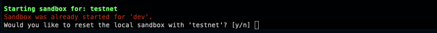
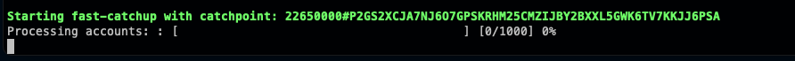
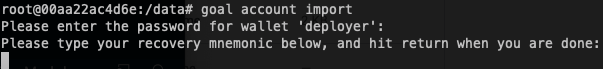
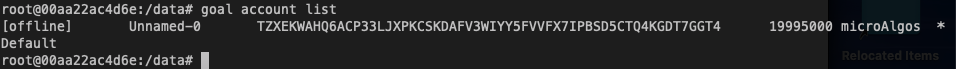
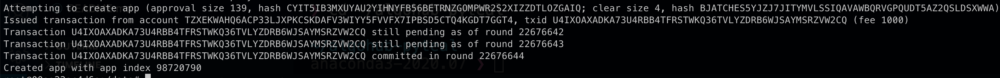

# Switching Sandbox to Testnet and Deploying our Smart Contract
Let's go back to our terminal, and go into the directory we setup in Lab 1 (on my device it is `~/algohub-pyteal/sandbox`).

Next we have to bring up the sandbox again, but this time we do it in Testnet so that we can deploy to the test network.

*Note: This will erase anything in your dev sandbox*.

```bash
./sandbox up testnet -v
```
If you have previously done Lab 1, you will likely see a message like the one below.

  

Select 'y', and then once the images have loaded, you will see a new screen alerting you that they are performing fast catchup.

 

Fast catchup allows your node to sync to the test network faster, so we just have to wait for the catchup to complete between we continue.

Now the catchup has completed, it's time to deploy the smart contract.

First, we enter the aglod container and move into the directory that we have bound to our computer.

```bash
./sandbox enter algod
cd /data
```

Next, we need to create a wallet. During wallet creation, you have to set a password.

```bash
goal wallet new deployer
```

Now the wallet is created, we need to add our account that we created in Pera Wallet.

To do that, we want to copy the seed phase that we saved from Pera Wallet first, then run the following commands;

```bash
goal account import
```
enter our password for the wallet, then paste our seed phrase.

 

Now we can see our new account in `goal account list` -


Then we'll save our address in an environment variable using the format `export ONE=<YOUR ADDRESS>`

It's finally time to deploy our smart contract!

We can use the smart contract from Lab 1 to deploy.

```bash
goal app create --creator $ONE --approval-prog Lab1/approval.teal --clear-prog Lab1/clear.teal --global-ints 1 --global-byteslices 0  --local-ints 0 --local-byteslices 0
```
We then put our password in as we are accessing the wallet.

You may notice that this is slower than when we were working in dev, this is because we are interacting with the live testnet, so we have to wait for our transaction to be included.



At the end of the transaction outcome, you will see the last line is `Created app with app index 98720790` (your number will be different); this number is your App ID - copy this down as we will be using it later.


