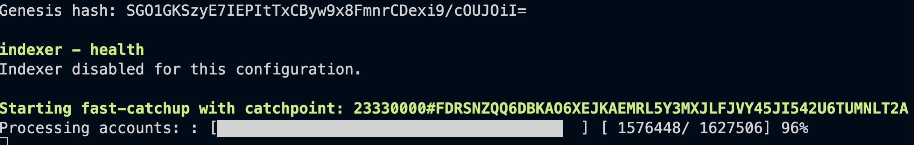

# Making changes to the Smart Contract, Redeploying and and updating web UI

Hi everyone! Welcome to Lab 3. The work we do in this lab directly builds off the previous, so please make sure that you have completed [Lab 2](../Lab2/README.md) before you get started.

In this tutorial, we are going to be making some changes to the PyTeal application we deployed previously, then redeploy it to the Algorand testnet and update the interface to reflect the changes.

## Pre-requisites
- a sandbox environment setup using docker
- A code editor (for the tutorial, I will be using [VSCode](https://code.visualstudio.com/))
- An Android or iOS device setup with Pera Wallet (as shown in [Lab 2](../Lab2/README.md)).
- Python 3

## Setting up the Sandbox
As we are using the Testnet, we want to make sure that our node quickly gets up to date with the current blockchain.

To do this, we first make sure we're in our algohub directory, and then we bring up the sandbox.

```bash
cd ~/algohub-pyteal
cd ./sandbox
```

If you have continued directly on from the last Lab, you don't need to worry about this next part.

```bash
./sandbox up testnet
```

By specifiying testnet again, we are forcing a reload of the blockchain to ensure that it performs a catchup.

 

This could take 5-10 minutes as it syncs with the testnet blockchain.

Now that we have that setup, we're ready to move to the next steps.

[Modify and compile counter app](./modifyAndDeploy.md)

[Update and experiment with the React UI](./updateUI.md)