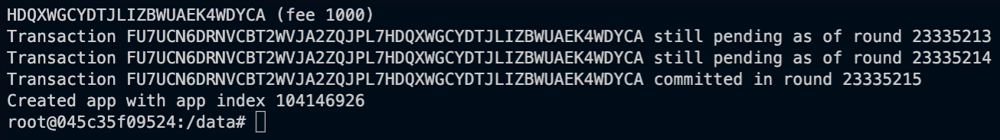
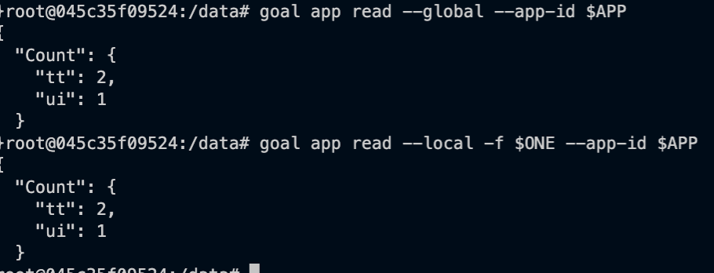

# Modify and deploy the counter app

In [Lab 2](../Lab2/README.md), we deployed a precompiled simple counter app.

The app stored the counter in global schema, but can cause some issues.

As the count is stored in the global schema, that means that the same counter is shared by anyone who interacts with the application, which reduces the usability for you as an individual.

So for this exercise, we will be adding a locally stored count (this means that it is stored locally with your account, and not locally on your machine).

When we are done, there will be both a global count and a local count in the smart contract.

To get started, we have taken the file [samplecontract.py](./samplecontract.py) from the [Algorand developer docs](https://developer.algorand.org/docs/get-details/dapps/pyteal/#final-product) - we will be making changes to this file.

If you don't have pyteal installed, first we need to install it.
```bash
pip install pyteal
```

Now let's open the `samplecontract.py` file.

The first item we want to edit is the name, so update the name (marked in comments by `# 1`).

```python
"""Modified Counter Application"""
```

The next part we need to change is for the `handle_optin` function to return success, or 1. This is because now we are using local state, all accounts will need to opt in to the application (again, marked by `# 2` in the file).

```python
handle_optin = Return(Int(1))
```

Next we need to create a scratch variable for the local account. This is a temporary variable that exists only in memory at runtime, and allows us to modify and manipulate values before storing them in the global or local schemas.

```python
# 3 - add local scratch var
localCount = ScratchVar(TealType.uint64)
```

Next, we need to rename the add and deduct methods to be add_global and deduct_global (this is marked as `# 4` in comments).

Then we create a local version of the add and deduct methods.

That looks something like this
```python
    add_local = Seq([
        localCount.store(App.localGet(Txn.sender(), Bytes("Count"))),
        App.localPut(Txn.sender(), Bytes("Count"), localCount.load() + Int(1)),
        Return(Int(1))
    ])

    deduct_local = Seq([
        localCount.store(App.localGet(Txn.sender(), Bytes("Count"))),
        If(localCount.load() > Int(0),
            App.localPut(Txn.sender(), Bytes("Count"), localCount.load() - Int(1)),
        ),
        Return(Int(1))
    ])
```

Few differences we can see from using the global data schema, firstly we use `App.localGet` and `App.localPut`. But notice there is an additional field we are sending to the local storage, `Txn.sender()`. This is the senders address, and tells the virtual machine to use the sender's address as the storage identifier.

We're nearly there! Next we need to update the handle_noop (the sequence that handles requests that interact with the smart contract).
```python
    handle_noop = Seq(
        Assert(Global.group_size() == Int(1)), 
        Cond(
            [Txn.application_args[0] == Bytes("Add_Global"), add_global], 
            [Txn.application_args[0] == Bytes("Deduct_Global"), deduct_global],
            [Txn.application_args[0] == Bytes("Add_Local"), add_local], 
            [Txn.application_args[0] == Bytes("Deduct_Local"), deduct_local]
        )
    )
```

We can see from above that we have updated the global function calls, and added new local calls.

Lastly, we need to go to the end of the file, and update the program to write to file instead of print to screen.

```python
# Write to file
appFile = open('approval.teal', 'w')
appFile.write(approval_program())
appFile.close()

clearFile = open('clear.teal', 'w')
clearFile.write(clear_state_program())
clearFile.close()
```

Once that's done, we can compile our project files using the command `python samplecontract.py`.

## Deploying to Testnet
We go back to the command line, and from the sandbox directory enter into the algod container

```bash
./sandbox enter algod
```

Once we're in the container, you should still have your testnet account visible with `goal account list`. So we'll store this address in an environment variable.

```bash
goal account list
export ONE=5JBNHJO4USUOJDEKIU6K2WFAO23X66EXI2GEA7D24IWGXQ5XDOHRJDDQGU
```
Now we deploy our newly compiled smart contract to the Testnet.

```bash
root@045c35f09524:/data# goal app create --creator $ONE --approval-prog Lab3/approval.teal --clear-prog Lab3/clear.teal --global-ints 1 --global-byteslices 0 --local-ints 1 --local-byteslices 0
```


We can see the app id returned after the app has been deployed.

For testing, we can save the app in an environment variable.

```bash
export APP=104146926
```

Because we are using local state, we have to first opt in to the smart contract application. Once we have logged in, we'll test adding to the local and global counter.

```bash
goal app optin --app-id $APP -f $ONE
goal app call --app-id $APP -f $ONE --app-arg 'string:Add_Global'
goal app call --app-id $APP -f $ONE --app-arg 'string:Add_Local'
```

Now that we have interacted with the smart contract, we need to read the global and local state to make sure it worked.

```bash
# First global
goal app read --global --app-id $APP
# Then local
goal app read --local -f $ONE --app-id $APP
```


Just before we wrap up this section, we should also check that the deduct parameter works locally and globally.

```bash
goal app call --app-id $APP -f $ONE --app-arg 'string:Deduct_Global'
goal app call --app-id $APP -f $ONE --app-arg 'string:Deduct_Local'
```