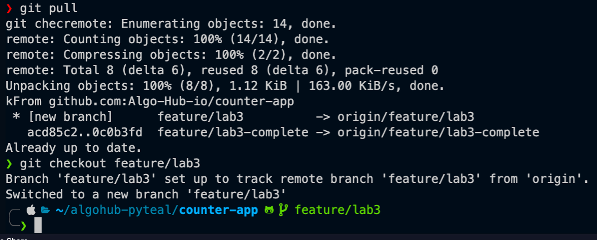
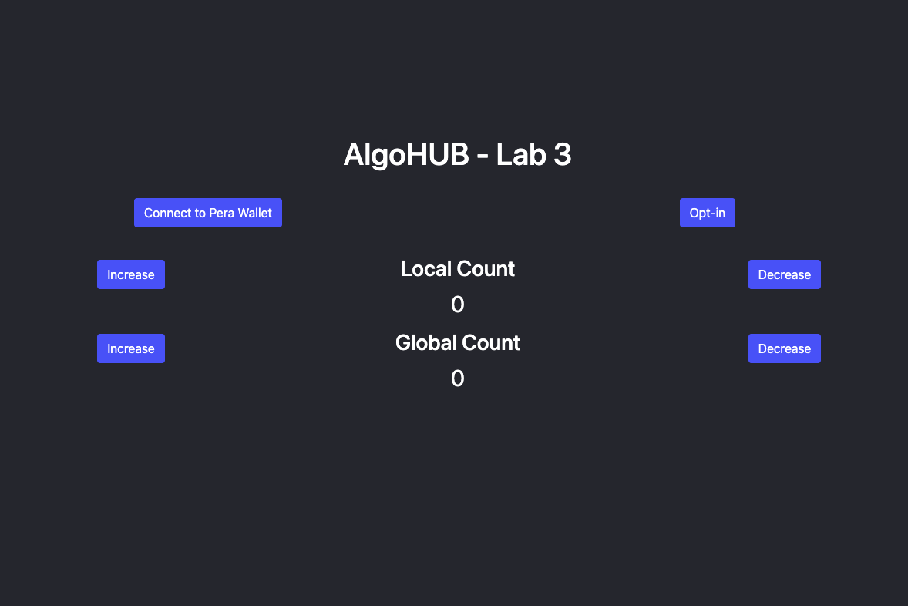

# Update and experiment with the React UI
Now that we have updated and deployed our smart contract (if you haven't done that yet, please complete [Modify and Deploy the Counter App](./modifyAndDeploy.md) first).

This tutorial isn't focused on learning react, so we will mainly focus on the changes that effect interacting with the smart contract.

First, open the counter app in your code editor (below is an example of how I would do it, but may not work for you)


We also need to make sure we are on the right branch for counter-app for this exercises (`feature/lab3`).

Below are the commands I use on the command line (note that I also used `git pull` at the start to ensure I have the latest version of the repo).



Once we have checked out the branch, there are several things to do - add the app index variable and add the string variables for the buttons to increase and decrease the local and global counts.

Adding the string variables looks like this -

```javascript
<Button className="btn-add-local"
     onClick={
        // add the method for the local add
        () => callCounterApplication('Add_Local')
      }>
```

```javascript
<Button className="btn-dec-local" 
     onClick={
      // add the local deduct method
      () => callCounterApplication('Deduct_Local')
      }>
```

```javascript
<Button className="btn-add-global"
     onClick={
      // add the global add function
        () => callCounterApplication('Add_Global')
      }>
```

```javascript
<Button className="btn-dec-global" 
     onClick={
      // add the deduct global function
      () => callCounterApplication('Deduct_Global')
      }>
```

Once that's all updated, we can run the app with `npm start`.

That should look something like this.

